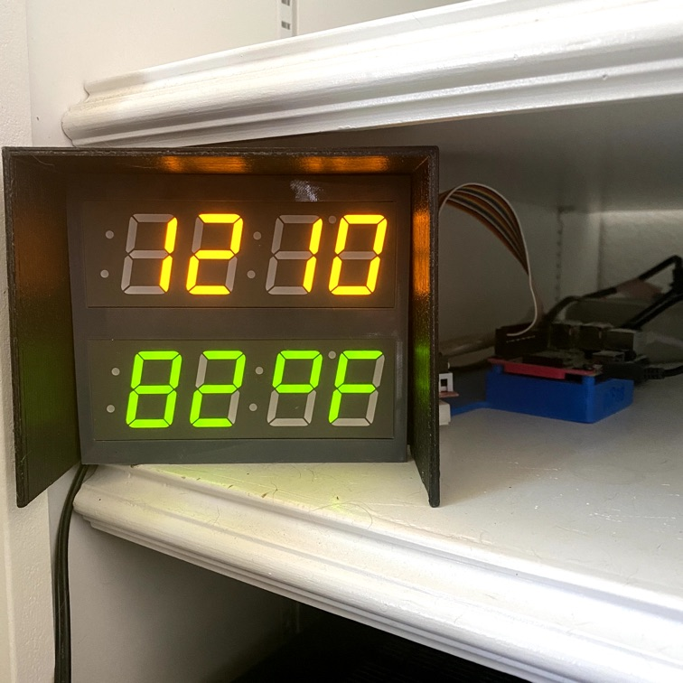

timetemp3
=========

Monitor and display time/temp with RasPi and log to cloud




Based on https://github.com/idcrook/timetemp - See original project for additional hardware details, setup, and more, including a [webpage that displays live charts of data](https://idcrook.github.io/timetemp/).


Install
-------

Install pre-reqs and dependencies

```shell
# python and build system dependencies
sudo apt install -y git build-essential python3-setuptools python3-dev \
    python3-pip python3-venv python3-wheel

# for extra systemd functionality
sudo apt install python3-systemd

# additional system dependencies for Adafruit-LED-Backpack
#sudo apt install python3-smbus python3-pil
```

now for the fun part

```shell
mkdir ~/projects
cd ~/projects
git clone https://github.com/idcrook/timetemp3.git
cd ~/projects/timetemp3

# --system-site-packages used for python3-systemd
python3 -m venv --system-site-packages .venv
source .venv/bin/activate

# work-around for geojson dependency from pyowm
#pip install geojson requests

# perform the python setup, which also includes dependencies
pip install .
# for development, use instead
pip install -e .
```

Run
---

The i2c addresses in the scripts and config files may need to be updated for your hardware.

```shell
cd ~/projects/timetemp3
cp conf/weather_logging_config.example.json conf/weather_logging_config.json
# edit conf/weather_logging_config.json
touch conf/phant-config.json
# replace conf/phant-config.json with a phant data source config file
```

Using venv, can run the `timetemp_*` wrapper scripts the Python `setup.py` installed

```shell
cd ~/projects/timetemp3
source .venv/bin/activate

timetemp_7segment_clock
# <Ctrl-C> to exit

timetemp_weather_logging conf/weather_logging_config.json conf/phant-config.json
# <Ctrl-C> to exit
```

Run as systemd service
----------------------

On my Raspberry Pi OS system, `groups` includes "`gpio i2c`" so these services do not need to run as root user.

Install user unit file. Assumes git clone at `/home/pi/projects/timetemp3/` and has been installed

```shell
# needed for `host` command that does network connectivity check
sudo apt install bind9-host
cd /home/pi/projects/timetemp3/
conf/install_services.sh
```


Test
====

```shell
# run tests from setup
python3 setup.py test

# manually run tests (pynose is nose fixed to run in >=python3.10)
pip install pynose
nosetests
```

TODO
====

See [TODO.org](TODO.org)
